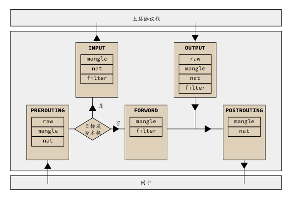

# iptables 

netfilter/iptable: IP包信息过过滤系统，它实际上由两个组件netfilter、iptables组成。  

- netfilter组件是内核的一部分，由一些信息过滤表组成，这结表包含用来控制信息过滤处理的规则集。  
 
- tables组件是一种工具，也称为用户空间，它使维护表中的规则变得容易。  

## iptables 表和链

### 表  
表的优先级：raw > mangle > nat > filter  
- raw  
用于处理异常，包含的规则链有：prerouting,output,一般不使用。
- mangle  
修改数据包内容，用来做流量整形，给数据包打标识。默认的链有：input,output,nat,prerouting,postrouting
- nat  
网络地址转换，包含的规则链有: input,prerouting,ouput,postrouting
- filter  
负责过滤数据包，包含的规则链有:input,output,forword  

### 链
Iptables匹配有五个链，数据在五个链上传递，在链的内部，自上而下按顺序匹配规则依次进行检查，找到相匹配的规则即停止，如果在链上找不到匹配的规则，则按该链的默认规则进行处理。
- PREROUTING
- INPUT
- OUTPUT
- FORWORD
- POSTROUTING

| 表/链 | INPUT链 | FORWARD链 | OUTPUT链 | PREROUTING链 | POSTROUTING链 |  
|:----: |:----: |:----: |:----: |:----: |:----: |  
| filter表 | 有 | 有 | 有 | 无 | 无 |  
| nat表 | 有 | 无 | 有 | 有 | 有 |  
| mangle表 | 有 | 有 | 有 | 有 | 有 |  

## 工作流程




## iptables 命令语法及示例

### 语法  
iptables (选项) (参数)

### 选项
-t<表>：指定要操纵的表；  
-A：向规则链中添加条目；  
-D：从规则链中删除条目；  
-i：向规则链中插入条目；   
-R：替换规则链中的条目；  
-L：显示规则链中已有的条目；  
-F：清除规则链中已有的条目；  
-N：创建新的用户自定义规则链；  
-P：定义规则链中的默认目标；  
-h：显示帮助信息；  
-p：指定要匹配的数据包协议类型；  
-s：指定要匹配的数据包源ip地址； 

- o 流入  
- i 流出  
- s 来源地址  
- d 目的地址  
- p 协议类型   
- dport 目的端口  
- sport 来源端口  
 
-j<目标>：指定要跳转的目标动作；  

- ACCEPT：接收数据包。 
- REJECT：拒绝数据包
- DROP：丢弃数据包。  
- REDIRECT：重定向、映射、透明代理。  
- SNAT：源地址转换。  
- DNAT：目标地址转换。  
- MASQUERADE：IP伪装（NAT），用于ADSL。  
- LOG：日志记录。 

-i<网络接口>：指定数据包进入本机的网络接口；  
-o<网络接口>：指定数据包要离开本机所使用的网络接口。  

### 示例  

```bash
## 查看filter表input链中的规则
iptables -L INPUT
## 清空filter表INPUT链中的规则
iptables -F INPUT
## 清除所有规则  
iptables –F
## 修改filter表INPUT链的默认规则
iptables -P INPUT ACCEPT
## 拒绝所有人的访问
iptables -t filter -A INPUT -j DROP  
## 删除链中的某一条规则
iptables -t filter -D INPUT 1
iptables -t filter -D INPUT -s 192.168.1.100 -j DROP  
## 删除从eth0网卡进入的包
iptables -A INPUT -i eth0 -j DROP
## 拒绝从192.168.0.101发过来的包
iptables -A INPUT -s 192.168.0.101 -j REJECT  
## 拒绝从123.45.6.1到123.45.6.254发过来的包
iptables -I INPUT -s 123.45.6.0/24 -j REJECT
## 拒绝被ping
iptables -A INPUT -p icmp -j REJECT
## 将内网192.168.0.0/12源地址修改为1.1.1.1
iptables -t nat -A POSTROUTING -s 192.168.0.0/24 -j SNAT –to 1.1.1.1
## 导出保存规则
iptables-save > /etc/sysconfig/iptables
## 导入规则
iptables-restore < /etc/sysconfig/iptables

```
