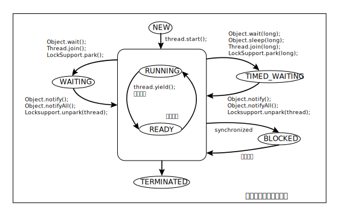

## JAVA

### 并发

1. 在JVM中，线程可以分为daemon线程和普通线程，它们的主要区别  
> 答： daemon会随着main线程的停止而停止，普通线程则不会。

2. JVM线程的状态迁移过程描述：
> 



3. volatile关键字的作用。一般在什么情况下使用volatile关键字。
> 答：volatile的作用有  
> - 64位写入原子性;
> - 内存可见性;
> - 禁止指令重排序;  
> 一般在多线程环境对一个变量的一写多读情况使用。  
> 如果是一写一读，使用无锁队列的内存屏障，不需要加锁，JDK8开始，Unsafe类提供了三个内存屏障函数。
> 如果是多写多读，则使用无锁队列CAS    

4. 简述锁实现的基本原理，或者说实现一把锁的前提条件，也可以说锁的核心要素。  
> 答: 一把具有阻塞或唤醒功能的锁，需要具有几个核心要素：
> - 需要一个state变量，标记该锁的状态。至少有两个状态。对state的操作需要保证线程安全。一般使用CAS  
> - 需要记录当前哪个线程持有锁  
> - 需要底层支持将一个线程阻塞或唤醒操作  
```java
// Unsafe类提供了阻塞和唤醒的操作原语
// LockSupport也是将Unsafe原语进行的封装。
public native void unpark(Object var1);
public native void park(boolean var1,long var2);
```
> - 需要一个队列维护所有阻塞的线程。这个队列也必须是线程安全的无锁队列。一般使用CAS实现  